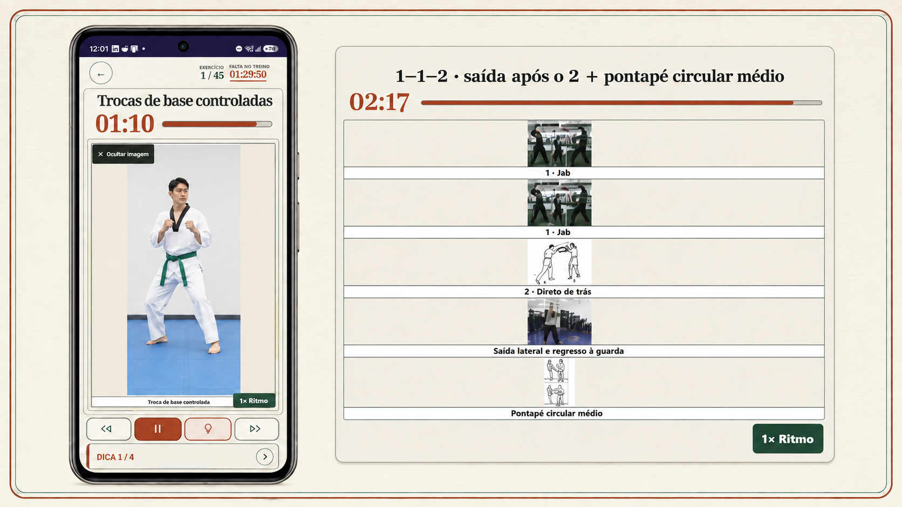

# TKD Coach

Aplicação Android de treino de Taekwondo que combina sessões guiadas, criação livre de workouts, um catálogo visual de exercícios e Poomsae passo a passo numa experiência concebida para funcionar durante o treino.

<p align="center">
  
</p>

## Descarregar a aplicação

[](https://github.com/biapferreira21/tkd-coach-android/releases/latest/download/TKD-Coach-v63.apk)

A versão Android mais recente é a **63.0** (`versionCode 10068`), para Android 7.0 ou posterior. A APK está assinada e disponível nos [Releases do GitHub](https://github.com/biapferreira21/tkd-coach-android/releases/latest), fora do histórico do código-fonte.

1. No telemóvel Android, descarregar `TKD-Coach-v63.apk`.
2. Abrir o ficheiro transferido.
3. Se o Android pedir autorização, permitir temporariamente a instalação de aplicações desta fonte.
4. Escolher **Instalar** ou **Atualizar**.

SHA-256 da APK publicada:

```text
25EC00AB77E9306BF67089A3A8280CBCB4F715B11E802C73C395526A13A81129
```

> Esta é uma distribuição direta para teste. O Android pode avisar que a aplicação não veio da Google Play porque a instalação é feita através de uma APK.

## Como funciona

<p align="center">
  
</p>

A sessão ativa mostra o exercício atual, o tempo desse exercício, a posição no treino e o tempo total restante. As imagens podem permanecer visíveis como referência; os controlos inferiores permitem recuar, pausar, consultar dicas e avançar. Exercícios compostos podem apresentar cada movimento pela ordem da sequência.

## O problema que resolve

Planear um treino variado implica normalmente consultar várias listas, temporizadores, fotografias e vídeos. A TKD Coach reúne essas peças numa única aplicação: escolhe-se ou constrói-se uma sessão, define-se a ordem e os tempos e o telemóvel acompanha todo o treino sem exigir navegação constante.

## Principais funcionalidades

- 13 treinos completos já preparados
- Treinos personalizados sem limite artificial de exercícios
- Nomeação, edição, eliminação e repetição de treinos guardados
- Duração individual configurável para cada exercício
- Descansos inseridos entre exercícios
- Loops de grupos de exercícios com número de repetições definido pela utilizadora
- Reordenação manual e opção **Baralhar** apenas para a sessão atual
- Taegeuk 1–8 e Koryo passo a passo
- Catálogo com Taekwondo, Poomsae, boxe, kickboxing, cardio, força, alongamentos e pesos livres
- Fotografias e miniaturas incorporadas para consulta offline
- Temporizador por exercício, posição atual e tempo total restante
- Modo de sessão concentrado no nome, tempo e imagem
- Ecrã mantido ativo durante o workout
- Voz Android local e integração opcional com ElevenLabs
- Histórico e progresso guardados no dispositivo

## Poomsae

As formas são apresentadas golpe a golpe, com a ordem didática completa:

| Forma | Etapas didáticas |
| --- | ---: |
| Taegeuk Il Jang | 20 |
| Taegeuk I Jang | 23 |
| Taegeuk Sam Jang | 34 |
| Taegeuk Sa Jang | 31 |
| Taegeuk Oh Jang | 32 |
| Taegeuk Yuk Jang | 29 |
| Taegeuk Chil Jang | 33 |
| Taegeuk Pal Jang | 38 |

As oito Taegeuk totalizam 240 etapas didáticas. A Koryo está disponível como sequência adicional.

## Arquitetura

| Camada | Implementação |
| --- | --- |
| Aplicação Android | Java e Android WebView |
| Interface | HTML semântico, CSS e JavaScript |
| Dados do treino | Estruturas JavaScript e JSON incorporadas |
| Persistência | Armazenamento local no dispositivo |
| Voz local | Android Text-to-Speech |
| Voz premium | ElevenLabs, configurada opcionalmente pela utilizadora |
| Conteúdo offline | Assets incluídos dentro da APK |

```text
app/src/main/
  java/com/tkdcoach/mobile/MainActivity.java   Ponte Android, voz e ciclo de vida
  assets/www/index.html                        Estrutura da interface
  assets/www/app.js                            Treinos, editor e sessão ativa
  assets/www/styles.css                        Design responsivo
  assets/www/poomsae-sequences.js              Sequências das formas
  assets/www/weights-v53.js                     Catálogo de pesos livres
  assets/www/assets/                            Fotografias, arte e ícones
  res/                                          Tema e ícone Android
```

## Executar no Android Studio

Requisitos:

- Android Studio
- Java 17
- Android SDK compatível com `compileSdk 37`

Passos:

1. Clonar o repositório.
2. Abrir a pasta raiz no Android Studio.
3. Aguardar a sincronização do Gradle.
4. Ligar um dispositivo Android ou iniciar um emulador.
5. Executar o módulo `app`.

## Gerar uma APK de teste

No Android Studio, selecionar **Build → Build APK(s)**. O resultado de debug fica normalmente em:

```text
app/build/outputs/apk/debug/app-debug.apk
```

Uma versão destinada à Google Play deve ser gerada como Android App Bundle e assinada com uma chave de lançamento privada. Keystores, passwords, APKs e AABs estão excluídos pelo `.gitignore`; a APK pública de teste é distribuída separadamente como ficheiro de um GitHub Release.

## ElevenLabs e privacidade

A chave ElevenLabs não está incluída no código nem no repositório. É introduzida dentro da aplicação e guardada localmente no dispositivo. O código publicado contém apenas a integração necessária para enviar texto à API quando essa funcionalidade é ativada.

Os treinos personalizados, o histórico, as preferências e o progresso também permanecem no dispositivo nesta versão.

## Fotografias e atribuições

O projeto inclui recursos próprios e imagens externas com proveniência registada nos manifestos e relatórios de validação. Antes de redistribuição comercial ou publicação numa loja, devem ser revistas as condições da página original de cada recurso e mantidas as atribuições exigidas.

## Segurança do repositório

O histórico público não inclui:

- chaves ElevenLabs;
- passwords de assinatura;
- keystores;
- configuração local do Android SDK;
- APKs ou Android App Bundles no histórico Git. A APK pública é anexada apenas ao respetivo GitHub Release.

## Autoria

Produto idealizado e dirigido por **Beatriz Pereira Ferreira**, com Codex utilizado como parceiro de implementação, pesquisa de recursos, testes e documentação.
